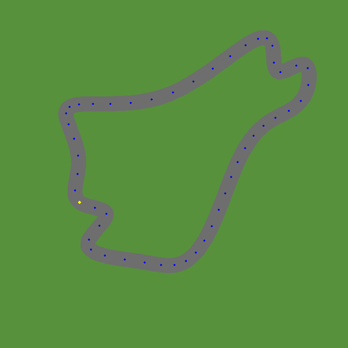
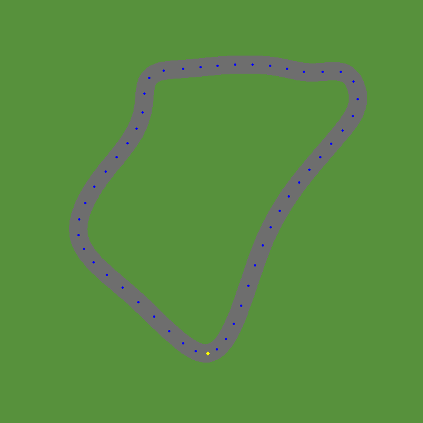

# Race Track Generator

## Table of Contents
1. [Introduction](#introduction)
2. [Articles Followed](#articles-followed)
3. [Installation](#installation)
4. [Usage](#usage)
	- [Generate a new track](#generate-a-new-track)
	- [Load a track](#load-a-track)
5. [Class Arguments](#class-arguments)

## Introduction
This project generates different tracks for a racing game. The tracks are generated using a procedural generation algorithm. The algorithm generates a track by:
1. Generating a series of random points
2. Calculating its [Convex Hull](https://en.wikipedia.org/wiki/Convex_hull)
3. Creating perturbations in the convex hull to make the track more interesting

Here are some of the examples produced by the algorithm:
<div style="display: flex; justify-content: space-evenly">
  
  
</div>

## Articles Followed
To build this project, I followed the following articles:
- [Procedural Racetrack Generation](https://bitesofcode.wordpress.com/2020/04/09/procedural-racetrack-generation/) by [juangallostra](https://bitesofcode.wordpress.com/author/juangallostra/)
- [Generating Procedural Racetracks](https://www.gamedeveloper.com/programming/generating-procedural-racetracks) by [Gustavo Maciel](https://www.gamedeveloper.com/author/gustavo-maciel)

## Installation
To install the dependencies needed for this project, run the following command:
```bash
pip install -r requirements.txt
```

## Usage
The user can generate a new track or load a track from a file.

### Generate a new track
When generating a new track, two new files will be created:
- `track.pkl`: Contains the track data
- `track.png`: Contains the image of the track

```python
from generator import RaceTrackGenerator

WIDTH, HEIGHT = (700, 700)
window = pygame.display.set_mode((WIDTH, HEIGHT))

g = RaceTrackGenerator(window)
g.generate_track()
```

### Load a track
```python
from generator import RaceTrackGenerator

WIDTH, HEIGHT = (700, 700)
window = pygame.display.set_mode((WIDTH, HEIGHT))

g = RaceTrackGenerator(window)
g.load_track("track.pkl")
```

## Class Arguments
The `RaceTrackGenerator` class takes the following arguments:
- `window` (`pygame.Surface`): The window where the track will be displayed
- `display_checkpoints` (`boolean`): Whether to display the checkpoints on the track image
- `filename` (`string`): The name of the file where the track data (image and pickle file) will be saved

```python
g = RaceTrackGenerator(window, display_checkpoints=True, filename="track")
```